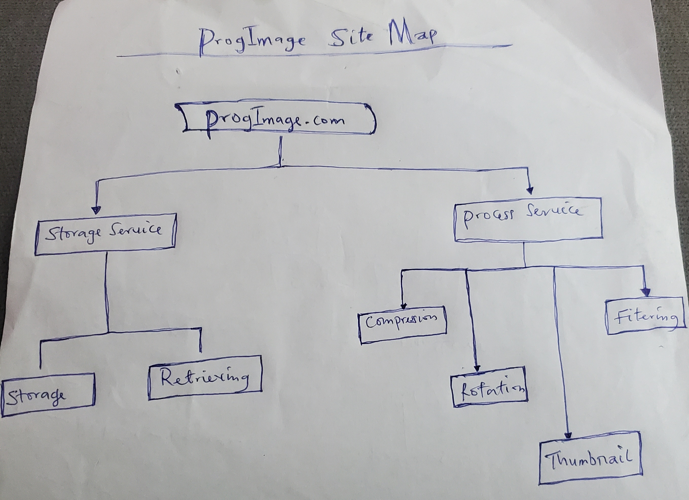

# ProgImage.com

## Technologies

- [Python 3.9](https://python.org) : Base programming language for development
- [FastAPI](https://fastapi.tiangolo.com/) : Development framework used for the application
- [Amazon S3](https://aws.amazon.com/s3/): Amazon Simple Storage Service (Amazon S3) is an object storage service offering scalability, data availability, security, and performance.
- [Pillow](https://pillow.readthedocs.io/en/stable/) : A python Library for image processing
- [Bash Scripting](https://www.codecademy.com/learn/learn-the-command-line/modules/bash-scripting) : Create convenient script for easy development experience
- [Celery](https://github.com/celery/celery): A simple, flexible, and reliable distributed system to process vast amounts of tasks
- [Flower](https://github.com/mher/flower): A web based tool for monitoring and administrating Celery clusters.
- [Redis](https://github.com/redis/redis-py): A NoSQL Database that serves as a Celery Broker and Result Backend
- [Github Actions](https://docs.github.com/en/free-pro-team@latest/actions) : Continuous Integration and Deployment
- [Docker Engine and Docker Compose](https://www.docker.com/) : Containerization of the application and services orchestration

## ProgImage Site Map

## Getting Started

Getting started with this project is very simple, all you need is to have Git and Docker Engine installed on your machine.

- Clone the repository `git clone https://github.com/olacodes/prog-image.git`
- change directory `cd prog-image`.
- Copy .env.dev to .env `cp .env.dev .env`
- Run `docker-compose up --build`

**NB:** _Running the above command for the first time will download all docker-images and third party packages needed for the app. This will take up to 5 minutes or more for the first build, others will be in a blink of an eye_

At this moment, your project should be up and running and start up the following Servers:

| Servers                        | Base URL              |
| ------------------------------ | --------------------- |
| FastAPI Storage service Server | http://localhost:8000 |
| FastAPI process Service Server | http://localhost:9000 |
| Redis Server:                  | http://localhost:6379 |
| Celery Flower:                 | http://localhost:5555 |

## Exploring The App

Make sure that all the above servers are running before you start exploring the project. If those servers are up and running, Let's have fun with the app!!!

### Storage Service

The storage service allows you to store image and retrieve them.

The following are the endpoints available

| Endpoints                      | Methods     | Content Type Accept |
| ------------------------------ | ------------|---------------------|
| Storage
| /api/v1/images/                | Post        | multipart/form-data |
| /api/v1/images/urls            | Post        | application/json    |
| Retrieve
| /api/v1/images/                | Get        | application/json   |
| /api/v1/images/{image_name}    | Get        | application/json    |
| /api/v1/images/file/{file_name}| Get        | application/json    |

### Process Service

Process service is a Restful api service that allows you to process images like, compression, adding filters, rotate images,and thumbnail creation

The following are the endpoints available from the `base_url: http://localhost:9000`

| Endpoints                      | Methods     | Content Type Accept |
| ------------------------------ | ------------|---------------------|
| Compression
| /api/vi/compress/files         | Post        | multipart/form-data |
| /api/vi/compress/urls          | Post        | application/json    |
| Filters
| /api/vi/filters/files          | Post        | multipart/form-data |
| /api/vi/filters/urls           | Post        | application/json    |
| Rotation
| /api/vi/rotate/files           | Post        | multipart/form-data  |
| /api/vi/rotate/urls            | Post        | application/json     |
| Thumbnail
| /api/vi/thumbnail/files        | Post         | multipart/form-data |
| /api/vi/thumbnail/urls         | Post         | application/json    |

## License

The MIT License - Copyright (c) 2022 - Present, ProgImage.com Storage Service.

## Author

Sodiq Olatunde
